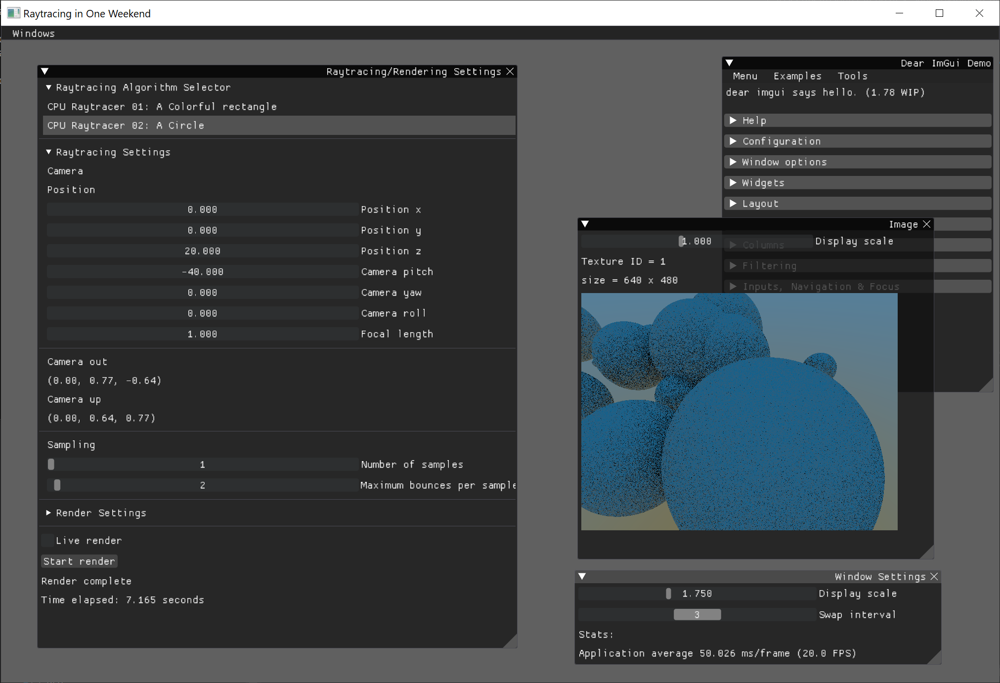

# Computer Vision Sandbox

All my personal, non-academic computer vision research lies here.

So far, all my projects are written in C++. This allows me to practice using standard, free tools to make fast, lightweight standalone applications that are relatively easy to integrate with hardware like GPUs and TPUs. Check out my setup at [docs/setup.md](docs/setup.md)

# Libraries

|                           Name |                                                         Installation instructions                                                         | License                                                                            | Github Repository                            |
| -----------------------------: | :---------------------------------------------------------------------------------------------------------------------------------------: | :--------------------------------------------------------------------------------- | :------------------------------------------- |
|  [OpenCV](https://opencv.org/) |   [official instructions as of 7/13/2020 (volatile)](https://docs.opencv.org/master/df/d65/tutorial_table_of_content_introduction.html)   | [3-clause BSD License](https://opencv.org/license/)                                | [yes](https://github.com/opencv/opencv)      |
| [GLAD](https://glad.dav1d.de/) | Included in project [(Unofficial instructions)](https://learnopengl.com/Getting-started/Creating-a-window) (path to KHR library modified) | [Varies](https://github.com/Dav1dde/glad#whats-the-license-of-glad-generated-code) | [Generator](https://github.com/Dav1dde/glad) |
|  [GLFW](https://www.glfw.org/) |                        Included in project [(Official instructions)](https://github.com/glfw/glfw#compiling-glfw)                         | [zlib license](extern/glfw/LICENSE)                                                | [yes](https://github.com/glfw/glfw)          |
|                          ImGui |                                                   Included in project (static library)                                                    | [MIT License](extern/imgui/LICENSE)                                                | [yes](https://github.com/ocornut/imgui)      |

Note that, though my source code is released under the [MIT license](LICENSE), cloning this repository may still bind you to the licenses of the libraries mentioned above.

# Projects
Here are all my projects so far:

|                                                          Name | Description                                                                                                                                          |
| ------------------------------------------------------------: | :--------------------------------------------------------------------------------------------------------------------------------------------------- |
|                             [Hello World](src/01-Hello-World) | A basic project that loads with OpenCV and displays it in a window                                                                                   |
|                               [Hello GLFW](src/02-Hello-GLFW) | A basic project that creates a window and an OpenGL context with GLFW and GLAD                                                                       |
|                             [Hello ImGui](src/03-Hello-ImGui) | A basic project that uses the GLFW window created from project 02 to create a simple Gui with ImGui                                                  |
|                     [GLFW and OpenCV](src/04-GLFW-and-OpenCV) | A combination of Projects 01 and 02, loading an image with OpenCV and displaying the generated OpenCV Mat with GLFW                                  |
|          [GLFW and OpenCV and ImGui](src/05-OpenCV-and-ImGui) | A combination of Projects 03 and 04, loading an image with OpenCV and displaying the generated OpenCV Mat with GLFW *on an ImGui window*             |
| [Raytracing in One Weekend](src/06-Raytracing-in-One-Weekend) | My GUI setup, applied with the book [Ray Tracing in One Weekend](raytracing.github.io), in attempt to interactively render 3D images via ray tracing |
|                               [Hello CUDA](src/07-Hello-CUDA) | A basic program written in CUDA C++                                                                                                                  |
|                     [CUDA and OpenGL](src/08-CUDA-and-OpenGL) | A basic program written in CUDA to modify an OpenGL texture using a per-pixel function                                                               |
|         [OpenCV Video Template](src/09-OpenCV-Video-Template) | A template program for video analysis with OpenCV                                                                                                    |
|         [Convolution Benchmark](src/10-Convolution-Benchmark) | A whole suite of eight janky matrix convolution implementations in C. Plus benchmark software to assess my incompetence!                             |
