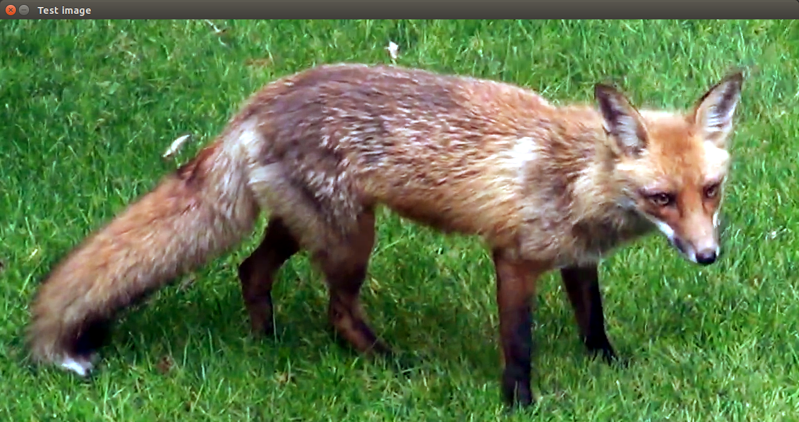

# Project 1: Hello World (with OpenCV) <!-- omit in toc -->
This simple project loads and displays an image in OpenCV using a [single C++ source code file.](CV-Sandbox.cpp)

# Table of Contents <!-- omit in toc -->
- [The Gist](#The-Gist)
	- [Generating a Filename](#Generating-a-Filename)
	- [Loading an Image](#Loading-an-Image)
	- [Showing an Image](#Showing-an-Image)
	- [Waiting for the User to Exit the Window](#Waiting-for-the-User-to-Exit-the-Window)
- [Resources](#Resources)
	- [OpenCV](#OpenCV)

## The Gist
The process of loading and displaying the image is handled by
the `main()` function. The details regarding each of those actions 
are described in the OpenCV source code, but I do not intend to
cover those in this project. Rather, I hope to learn *how*
to use OpenCV (understanding `cv::Mat`'s, etc.) and to demonstrate
that my project structure is effective and works on multiple platforms.

While this code is relatively simple, I will highlight the most important
part here and remark on four of its parts:

### Generating a Filename
```C++
	string filename = MEDIA_DIRECTORY;
	filename += "RedFox.png";
```
I have defined `MEDIA_DIRECTORY` in the root CMake script.
It defines the path to the root media folder containing
all images and videos I use in these projects.

Here I intend to load a test image, called "RedFox.png",
that resides in that `MEDIA_DIRECTORY`.

### Loading an Image
```C++
	Mat image = imread(filename);
```
`imread` is a function defined by the OpenCV library.
It can decode many kinds of images and place them
into a `cv::Mat`, a matrix that stores all the values
of all the pixels in an image.

### Showing an Image
```C++
	imshow("Test image", image);
```
`imshow` is also a function defined by OpenCV.
It creates a new window and renders the `cv::Mat`
called *image* onto that window named "Test image".

I will not use this function frequently. OpenCV is not meant
to be an extensive graphics library, and I have demonstrated that
`cv::Mat`'s can be rendered in windows with interactive user interfaces 
in [Project 5](../05-OpenCV-and-ImGui).

### Waiting for the User to Exit the Window
```C++
	waitKey(0);
```
`waitKey` is a function defined by OpenCV
that tells OpenCV to pause the program until
the user has pressed any key.

I will not use this function frequently because of my personal
preference to use my own UI.

## Resources
### OpenCV
* [OpenCV tutorial on Mats](https://docs.opencv.org/master/d6/d6d/tutorial_mat_the_basic_image_container.html)
* [OpenCV tutorial on pixels](https://docs.opencv.org/master/db/da5/tutorial_how_to_scan_images.html)
