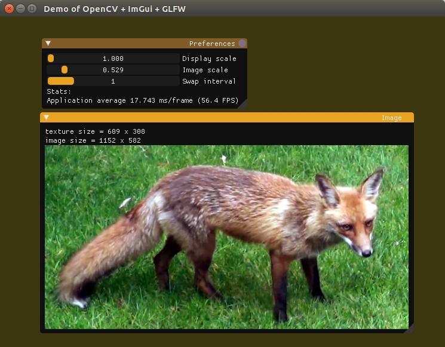

| Windows | Ubuntu |
|---------|--------|
| | |

# Project 5: GLFW + OpenCV + ImGui <!-- omit in toc -->
This project demonstrates the use of GLFW to create a window with an OpenGL context. 
Like all projects so far, this one exists in a [single C++ source code file.](main.cpp)

## Table of Contents <!-- omit in toc -->
- [Usage](#Usage)
- [The Gist](#The-Gist)
- [Resources](#Resources)
	- [Code samples](#Code-samples)
	- [Documentation](#Documentation)

## Usage
Three sliders control basic settings used in the render pipeline:
* **Display scale** controls how large the *GUI widgets and the images* appear on the screen. It is likely set to values higher than 1 on high-dpi screens because it accesses the OS's screen scale using `glfwGetMonitorContentScale()`.
* **Image scale** only controls how large the *images* appear on the screen.
* **Swap interval** is a way to change how many times the screen updates before redrawing it. Thus, higher values reduce the framerate but allow the program to require less computational resources. This setting doesn't work on my Jetson Nano, leaving the framerate equal to the frame rate of my monitor.

## The Gist
This project is a continuation of Project 4 and builds off of my ImGui setup from Project 3.

Like Projects 1 and 4, it opens the default fox image in the media directory with OpenCV.
The contents of that image are placed in a `cv::Mat`.
```C++
	// Load the image
	// Get an image name 
	string filename = MEDIA_DIRECTORY;
	// MEDIA_DIRECTORY is defined in the root-level CMake script
	filename += "RedFox.png";
	// Load the image
	const Mat image = imread(filename);
```

To render a cv::Mat on the ImGui window, I converted it to a `GLuint` using the `static GLuint matToTexture()` function introduced in project 4.
```C++
	GLuint image_texture = matToTexture(image, GL_LINEAR_MIPMAP_LINEAR, GL_LINEAR, GL_CLAMP);
```

Then, it can be rendered in a window using the `ImGui::Image()` function.
```C++
	mGui::Image((void*)(intptr_t)image_texture, imageSize);
```

## Resources
### Code samples
* [Yilin Gui's example about using GLFW and OpenCV](https://gist.github.com/insaneyilin/038a022f2ece61c923315306ddcea081)
* [Project 03: Hello ImGui](../03-Hello-ImGui)
* [Project 04: GLFW and OpenCV](../04-GLFW-and-OpenCV)
### Documentation
* [ImGui + GLFW + CMake demo](https://github.com/m516/imgui-opengl-glfw-glew-cmake-demo/)
* [ImGui issue #122: Recommended way to display an image](https://github.com/ocornut/imgui/issues/122)