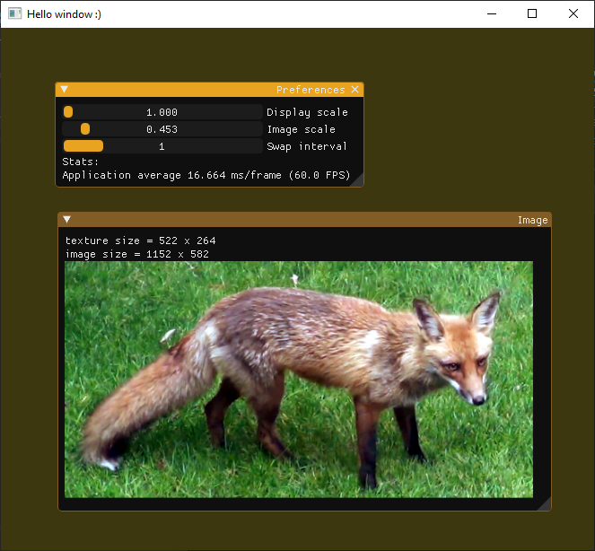

# Project 5: GLFW + OpenCV + ImGui <!-- omit in toc -->
This project demonstrates the use of GLFW to create a window with an OpenGL context. 
Like all projects so far, this one exists in a [single C++ source code file.](main.cpp)

## Table of Contents <!-- omit in toc -->
- [The Gist](#the-gist)
- [Resources](#resources)
	- [Code samples](#code-samples)
	- [Documentation](#documentation)

## The Gist
This project is a continuation of Project 4 and builds off of my ImGui setup from Project 3.

## Resources
### Code samples
* [Yilin Gui's example about using GLFW and OpenCV](https://gist.github.com/insaneyilin/038a022f2ece61c923315306ddcea081)
* [Project 03: Hello ImGui](../03-Hello-ImGui)
* [Project 04: GLFW and OpenCV](../04-GLFW-and-OpenCV)
### Documentation
* [ImGui + GLFW + CMake demo](https://github.com/m516/imgui-opengl-glfw-glew-cmake-demo/)
* [ImGui issue #122: Recommended way to display an image](https://github.com/ocornut/imgui/issues/122)