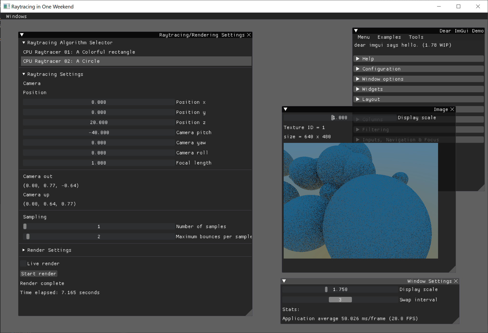

# Project 6: Raytracing on One Weekend <!-- omit in toc -->
This project contains the code I have written for the book [Ray Tracing in One Weekend](raytracing.github.io). By the time it's done, it will work the same way that the book's code does, rendering many spheres resting on a plane, but the results will be visible on a Gui like the one I made for Project 5. 

## Table of Contents <!-- omit in toc -->
- [Framework](#framework)
	- [UI/Graphics Separation](#uigraphics-separation)
- [Usage](#usage)
	- [1. Image Viewer](#1-image-viewer)
	- [2. Render Settings](#2-render-settings)
	- [3. Window Settings](#3-window-settings)
	- [4. Style Editor](#4-style-editor)
	- [5. Demo Window](#5-demo-window)
- [Raytracing](#raytracing)
- [Resources](#resources)
	- [Code samples](#code-samples)
	- [Documentation](#documentation)

## Framework
Four main file pairs control the user interface
* `main.cpp`/`main.h`: a shell for starting the application. Only contains `gui::begin();` in a `main()` function.
* `app.cpp`/`app.h`: responsible for creating a window with GLFW, loading OpenGL through GLAD, maintaining a render loop, initializing ImGui before rendering, and rendering the GUI at the end of the render loop. It also contains some application-specific helper functions in the namespace `gui`:
  * `float estimateSystemScale()`: uses GLFW to estimate the operating system's native scale.
  * `GLFWwindow* getCurrentWindow()`: gets the current GLFWwindow instance.
  * `void setSwapInterval(int newSwapInterval)`: sets the window's swap interval, i.e. how many frame refreshes before the GUI refreshes. This also sets the UI's framerate. Higher swap interval values yield a lower framerate, but reduce the CPU consumption and increase battery life of machines running the software. Note that this is specific to the operating system and may not work effectively.
  * `void setClearColor(int red, int green, int blue, int alpha)`: sets the color of the background.
  * `void setGuiScale(float guiScale)`: sets the scale of the GUI.
  * Most importantly `gui::begin()` starts the GUI and is called from `main`. 
* `ui.cpp`/`ui.h`: responsible for the GUI layout, controls, and behavior of the application. Without this files, only a blank window will be displayed.
  * `void setStyle()`: sets the look-and-feel of the UI. The settings I provide in this code create a gray background with black windows, white text, and orange highlights, but all the preferences I set can be changed in the style editor built into the application.
  * `void populateUI()`: responsible for the layout of the entire user interface.
  * `void initUI()`: initializes the variables and settings used for the user interface prior to the first time `void populateUI()` is called.

### UI/Graphics Separation

Rendering the graphics of a project this size was significantly more challenging than the simpler Project 5. But ImGui made the separation relatively easy due to its immediate-mode setup. This is how the render loop works:

1. A function under `app.cpp` called `render()` is called periodically from `begin()`, and it updates the window at a refresh rate set by the user due to the vertical synchronization from GLFW.
2. Then `render()` creates a new ImGui frame.
3. Then it runs the function `populateUI()` to load all the ImGui widgets I placed in the GUI.
4. Then it calls `ImGui::Render()`
5. Finally `populateUI()` renders the ImGui frame on the OpenGL pixel buffer using ImGui_ImplOpenGL3_RenderDrawData() to show the GUI to the user.

Therefore, `populateUI()`is not at all responsible for rendering the UI, yet 
it controls everything about the struture, layout, and appearance of the UI. Likewise,
`render()` controls the window and all tools used to display the GUI, but doesn't need to 
worry about how the GUI is set up or what it does.

## Usage

Five windows allow the user to control many aspects of the application:

### 1. Image Viewer
This window shows the rendered image on the screen and some useful information about the image and its underlying OpenGL texture. It only has one control:
1. **Display Scale** allows users to zoom in to and out of the image.

Hovering over the image creates a widget that allows the user to see a 4x magnified slice of the image.

### 2. Render Settings
This window controls the render pipeline. Its controls are separated into four groups:
1. **Raytracing Algorithm Selector** sets the algorithm used for rendering an image.
2. **Raytracing Settings** shows settings that are specific to the algorithm selected, including fields like camera position/direction and the number of samples to compute.
3. **Render Settings** determine the size of the image to render.
4. **The Render Button** begins the rendering process on a separate thread. The *Live Render* checkbox automatically starts the rendering process if an image is not currently rendering.

### 3. Window Settings
This window controls the graphics settings:
1. **Display Scale** sets the magnification of the GUI, which may increase the viewing experience of users with high-DPI displays. This defaults to the operating system's internal scale, but it can be set to any number.
2. **Swap Interval** sets the number of monitor-refreshes to wait until the GUI redraws.

### 4. Style Editor
This allows the user to customize the aesthetics of the GUI. It can be exported to C++ code.

It is a window provided by and included in the ImGui source code.

### 5. Demo Window
This is a demo window provided by and included in the ImGui source code.

## Raytracing
TODO explain raytracing

## Resources
### Code samples
* [Project 05: OpenCV and ImGui](../05-OpenCV-and-ImGui)
### Documentation
* [Ray Tracing in One Weekend](raytracing.github.io)
* [Ray Tracing in One Weekend source code](https://github.com/RayTracing/raytracing.github.io/)