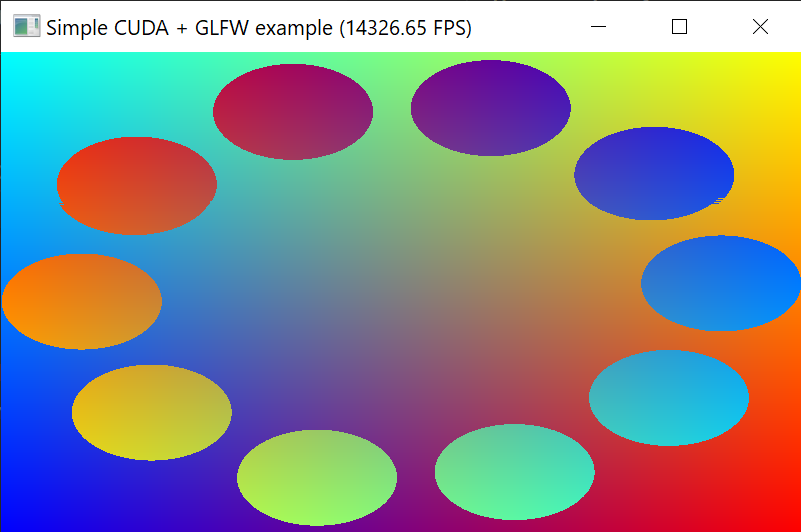

# Project 8: CUDA and OpenGL <!-- omit in toc -->
This project is a short demo that performs per-pixel processing with CUDA on an OpenGL texture. 

## Table of Contents <!-- omit in toc -->
- [How it Works (TODO)](#how-it-works-todo)
- [Resources](#resources)
  - [Code samples](#code-samples)
  - [Tutorials](#tutorials)
  - [Documentation](#documentation)

## How it Works (TODO)

## Resources
### Code samples
* postProcessGL CUDA example (under 3_Imaging folder of CUDA sample programs)
* [Allan MacKinnon's example of GLFW + CUDA in C](https://gist.github.com/allanmac/4ff11985c3562830989f)
* [p-andelfinger's example with SFML](https://github.com/p-andelfinger/cuda_gl_interop)
* [Project 04: OpenCV and GLFW (for creating OpenGL textures and using GLFW)](../04-GLFW-and-OpenCV)
### Tutorials
* [OpenGL Interoperability with CUDA (from 3D Game Engine Programming)](https://www.3dgep.com/opengl-interoperability-with-cuda/)
### Documentation
