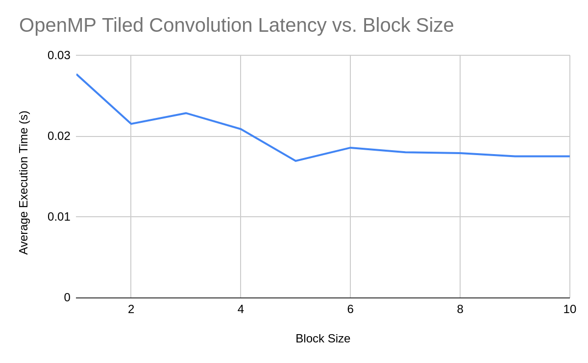

<!-- omit in toc -->
# Basic Matrix Convolution Implementation Suite
## *With Benchmarking Tools*

<!-- omit in toc -->
# Table of Contents
- [Matrix Convolution](#matrix-convolution)
  - [Introduction](#introduction)
  - [Aplications](#aplications)
    - [Image Processing](#image-processing)
    - [Artificial Intelligence](#artificial-intelligence)
- [Benchmarking](#benchmarking)
  - [Algorithm](#algorithm)
    - [Pseudocode](#pseudocode)
  - [Benchmarking Algorithms](#benchmarking-algorithms)
    - [void conv4d_convolve_serial_naive();](#void-conv4d_convolve_serial_naive)
    - [void conv4d_convolve_serial_discrete();](#void-conv4d_convolve_serial_discrete)
    - [void conv4d_convolve_serial_tiled(int block_size);](#void-conv4d_convolve_serial_tiledint-block_size)
    - [void conv4d_convolve_threads_discrete();](#void-conv4d_convolve_threads_discrete)
    - [void conv4d_convolve_threads_tiled(int block_size);](#void-conv4d_convolve_threads_tiledint-block_size)
    - [void conv4d_convolve_OpenMP_discrete();](#void-conv4d_convolve_openmp_discrete)
    - [void conv4d_convolve_OpenMP_tiled(int block_size);](#void-conv4d_convolve_openmp_tiledint-block_size)
    - [void conv4d_convolve_CUDA_discrete(int block_size, int grid_size);](#void-conv4d_convolve_cuda_discreteint-block_size-int-grid_size)
    - [void conv4d_convolve_CUDA_discrete_rewrite_gpu_data(int block_size, int grid_size);](#void-conv4d_convolve_cuda_discrete_rewrite_gpu_dataint-block_size-int-grid_size)
  - [Benchmarking Framework](#benchmarking-framework)
    - [File Structure](#file-structure)
    - [Data Structures](#data-structures)
  - [Benchmarking Build Procedure](#benchmarking-build-procedure)
    - [Process](#process)
    - [Hardware Used for Benchmarking](#hardware-used-for-benchmarking)
    - [Software Used for Benchmarking](#software-used-for-benchmarking)
- [Results](#results)
  - [TinyImageNet Neural Network Layer](#tinyimagenet-neural-network-layer)
    - [Tiled Performance](#tiled-performance)
    - [OpenMP Performance](#openmp-performance)
    - [CUDA Performance](#cuda-performance)
    - [Profiling](#profiling)
- [Conclusions](#conclusions)
  - [Toeplitz Matrices](#toeplitz-matrices)
  - [Fourier Transform](#fourier-transform)

Matrix Convolution
==================

Introduction
------------

Convolution is an operation involving two matrices: the image and the kernel. During this operation, elements in the convolved matrix are the sum of all nearby values in the image matrix weighted by the kernel. Usually, the kernel matrix is significantly smaller than the image.

To demonstrate the process of convolution, I’ll convolve two small, 1-dimensional matrices in the following figures. The input matrix (green) is [3,1,4,1,5,9,2], and the filter (red) [1,2,-1].

To get the first output of the matrix, add all the surrounding elements in the corresponding input array, weighted by the kernel.

Element 1: 

Note that the output matrix must be shifted to the right, so its corresponding element in the input matrix has neighbors in both directions.


The process is repeated for each element in the output matrix by sliding the filter over the input image.

Element 2: 

Element 3: 

Element 4: 

Element 5: 


Aplications
-----------

Two common uses for matrix convolution are in image processing and artificial intelligence. Both of these applications are described in the sections below:

### Image Processing

Many common image filters use matrix convolution. They do so by converting the image into a 3D matrix (width, height, channels, explained in greater detail in the next section)

A small filter (also known as a kernel) is slid across an image to produce an output image. Cleverly constructed filters can blur and sharpen the image, find corners and edges, and more.

### Artificial Intelligence

Matrix convolution allows efficient implementations of neural network approximations. Each neuron is an element in a matrix. Convolving the matrix simulates the synapses between neurons. The filter represents the sensitivity of each simulated synapse. By adjusting the values in the filter, each synapse’s sensitivity changes, affecting the output from the neural network. Software like TensorFlow contain programs that update these filters, a process known as training.

* * *

Benchmarking
============

Algorithm
---------

The process of convolution in this benchmark is an extension of the example in the previous section in a few ways. These extensions were included in the benchmark to increase parallelism complexity for the final project and to support common features in convolutional neural networks.

*   Convolution occurs in three dimensions. 3D convolution is natural for image processing because each image has three dimensions: width, height, and the number of channels. Figure 6 gives an example of the matrices’ structures and the variables used in the explanation and implementation of the algorithms. These variables are as follows:

*   W, H: The input image’s width and height
*   C: The number of channels in the input image. For example, many images have three color channels: red, green, and blue. Sometimes, there is an additional channel for transparency or alpha.
*   R, S: The filter’s width and height
*   P, Q: The output’s width and height
*   M: The number of channels in the output.
*   N (not shown): The number of input images that need to be applied by the filter. Assumed to be 1 in the diagram.
*   U (not shown): The stride length, i.e. how much the kernel slides across the input matrix. In figures 1-3, the stride length is 1 because the filter shifts to the right by one element each time an element in the output is calculated.


The diagram below highlights the cells in each matrix that are used during the first operation.


*   At the end of the convolution operation, the result of the convolution operation is incremented by a vector, called “bias.” This vector is used predominantly in convolutional neural networks as another way to fine-tune them.
*   After the bias was added, a function is applied to each element in the output matrix. This function is called the Rectified Linear Unit, and its function is  if x<0 and  when x≥0.

Because this convolution algorithm is targeted towards convolutional neural networks, terminology related to neural networks will be used in the program and explanation. For example, “input matrix” becomes “input feature map,” “filter” or “kernel” can become “weights,” etc.

* * *

### Pseudocode

```pseudocode
convolve(I, W, B, O):
    Parameters:
        I: the input feature map, a four dimensional array with dimensions [N][S+Q\*U][R+S\*U][C]
        W: the weights, a four dimensional array with dimensions [S][R][C][M]
        B: the bias, a one dimensional array with dimension [M]
    Returns:
    O: the output feature map, a four dimensional array with dimensions [N][Q][P][M]  
    Reset O so that each element is 0

    For each n in N:
        For each q in Q:
            For each p in P:
                For each m in M:
                    For each s in S:
                        For each r in R:
                            For each c in C:
                                Increase O[n][q][p][m] by I[n][q*U+s][p*U+r] * W[s][r][c][m]
                    Increase O[n][q][p][m] by B[m]  (Bias)
                    O[n][q][p][m] = f(O[n][q][p][m]) (Apply the activation function)

```

Benchmarking Algorithms
-----------------------

The benchmarking framework contains nine variations of the convolution algorithm described in the previous section, described below:

### void conv4d_convolve_serial_naive();

This algorithm convolves the input feature map by following the pseudocode verbatim, ignoring the machine’s hardware.

### void conv4d_convolve_serial_discrete();

This algorithm improves in performance because it splits the loops for convolution and bias, giving the compiler more flexibility to perform its assembly-level optimizations.

### void conv4d_convolve_serial_tiled(int block_size);

This algorithm attempts to further improve the performance by tiling the arrays, theoretically increasing cache hits.

### void conv4d_convolve_threads_discrete();

This algorithm is similar to conv4d_convolve_serial_discrete, except that the output feature map’s rows are distributed among threads using the Pthread library.

### void conv4d_convolve_threads_tiled(int block_size);

This algorithm is similar to conv4d_convolve_serial_tiled, except that the output feature map’s rows are distributed among threads using the Pthread library.

### void conv4d_convolve_OpenMP_discrete();

This algorithm is similar to conv4d_convolve_serial_naive, except that it uses OpenMP to distribute the workload between threads. Each element in the output feature map is its own task and is run in parallel with other elements.

It was based off of the naive version because the discrete version created a race condition.

### void conv4d_convolve_OpenMP_tiled(int block_size);

This algorithm is similar to conv4d_convolve_serial_tiled, except that it uses OpenMP to distribute the workload between threads. Each element in the output feature map is its own task and is run in parallel with other elements.

However, instead of tiling over q and p, tiling is performed over c so that the first three for loops can be collapsed. Again, this also helps remove the race condition, avoiding the need of a critical region.

### void conv4d_convolve_CUDA_discrete(int block_size, int grid_size);

This algorithm is similar to conv4d_convolve_serial_discrete, except that it uses CUDA to distribute the workload between threads on the GPU. Each element in the output feature map is its own task and is run in parallel with other elements. Blocking happens naturally due to Nvidia GPUs’ architectures.

### void conv4d_convolve_CUDA_discrete_rewrite_gpu_data(int block_size, int grid_size);

This algorithm is conv4d_convolve_CUDA_discrete, except that its memory policy is a bit different.

The CUDA functions use  their own global, device-specific memory. To convolve a matrix in CPU memory with CUDA, this program copies that matrix and the filter over to the device memory. Then a GPU kernel can run on the GPU memory. Finally, after the kernel completes, the output matrix (in GPU memory) is copied back to the CPU.

This function copies the input feature map and layer from the CPU memory into the GPU before running conv4d_convolve_CUDA_discrete, costing time.

Benchmarking Framework
----------------------

In addition to all nine functions, the benchmarking framework also contains tools to profile each algorithm and verify its correctness.

### File Structure

The project contains seven files:

*   [**CMakeLists.txt:**](CMakeLists.txt) A file used by CMake to build the project. It automatically disables benchmarks that aren’t supported by the machine.
*   [**conv4D_data_structures.h:**](conv4D_data_structures.h) Definitions of feature maps and functions that aid in the benchmarking process.
*   [**conv4D_data_structures.c:**](conv4D_data_structures.c) Implementation for functions in conv4D_data_structures.h.
*   [**conv4D_impl.h:**](conv4D_impl.h) Definitions of the benchmarking algorithms in the previous section.
*   [**conv4D_impl_CPU.c:**](conv4D_impl_CPU.c) Implementations of the benchmark that predominantly use the CPU (serial, OpenMP, and threads)
*   [**conv4D_impl_GPU.cu:**](conv4D_impl_GPU.cu) Implementations of the benchmark that predominantly use the GPU (CUDA)
*   [**main.c:**](main.c) the main() function that benchmarks each algorithm with a macro called BENCHMARK_ALGORITHM. The marco times the execution of an algorithm, calculates its average error, and prints the following information on one line, separated by a comma and a tab:
    *   Algorithm name
    *   Average execution time, not including the first trial. Lower values indicate higher performance.
    *   The average difference between the output and the expected output per unit. Lower values indicate higher accuracy.
    *   Parameters in the function, if any.

All files are placed in the folder src/10_Convolution_Benchmark.

### Data Structures

The convolutional layer and each feature map have their own data type and are stored in global memory. They’re defined in conv4D_data_structures.h.

Benchmarking Build Procedure
----------------------------

### Process

Step 1: Download a copy of the full project from the GitHub repository: [https://github.com/m516/CV-Sandbox](https://www.google.com/url?q=https://github.com/m516/CV-Sandbox&sa=D&ust=1606191316203000&usg=AOvVaw3a2pr48f6s7YckpR7IGOTj)

Step 2: In the root directory of the repository, run the following command:

```sh
cmake .
```

Step 3: Build the tool with make if you’re using Linux or Mac:

```sh
$ make 10_CONVOLUTION_BENCHMARK
```

Step 4: Run the program (contained in the bin subdirectory of the project folder)

```sh
$ bin/10_CONVOLUTION_BENCHMARK
```

### Hardware Used for Benchmarking

I used a Lenovo Yoga 730 to perform benchmarking. It has the following hardware components:

*   CPU: Intel Core i7-8550U
    *   Base clock: 1.80GHz
    *   Max. clock: 4 GHz
    *   Cache:
        *   L1 data: 128 kB
        *   L1 instruction: 128 kB
        *   L2: 1 MB
        *   L3: 8 MB
    *   Cores: 4
    *   Threads: 8
    *   NUMA nodes: 8
    *   RAM: 16 GB DDR4, 2400MHz
*   GPU: Nvidia GTX 1050 Mobile
    *   Clock: 33MHz
    *   4 GB dedicated RAM

The benchmark attempts to use as many resources as possible. OpenMP and Pthread implementations both take all 8 hardware threads.

### Software Used for Benchmarking

*   Operating system: agnostic (benchmarked with Ubuntu 20.04)
*   Language: C
*   Compiler: agnostic (benchmarked with GCC 9.3.0)
*   Build tool: CMake
*   Additional packages and libraries:
    *   OpenMP
    *   CUDA
    *   PThread

Results
=======

TinyImageNet Neural Network Layer
---------------------------

The first benchmark is based on an intermediate feature map that was extracted from a TinyImageNet neural network running on Tensorflow. The extracted feature map and convolutional layer data were placed in binary files under the media/dnn directory in the project folder. To ensure that all algorithms work as expected, the output feature map was also extracted into a file, and the values in the calculated feature map are compared with the corresponding values in the file.

These are the dimensions of the input feature map:

*   **Input feature map filename:** "dnn/Test_Input0/layer_0_output.bin"
*   **Layer weights filename:** "dnn/Test_Input0/conv2_weights.bin"
*   **Layer bias filename:** "dnn/Test_Input0/conv2_biases.bin"
*   **Input feature map filename:** "dnn/Test_Input0/layer_1_output.bin"
*   **Batch size:** 1
*   **Input feature map:** 60x60x32
*   **Layer:** 5x5x32
*   **Stride length:** 1

Here is the time required to compute each algorithm with this data (highest performing algorithm in bold):
<body>
    <table class="c34">
        <tbody>
            <tr class="c50">
                <td class="c45" colspan="1" rowspan="1">
                    <p class="c12"><span class="c13">Algorithm</span></p>
                </td>
                <td class="c51" colspan="1" rowspan="1">
                    <p class="c12"><span class="c13">Average Execution Time (s)</span></p>
                </td>
                <td class="c16" colspan="1" rowspan="1">
                    <p class="c12"><span class="c13">Error per Element in Output Feature Map</span></p>
                </td>
                <td class="c37" colspan="1" rowspan="1">
                    <p class="c12"><span class="c13">Speedup from serial_naive</span></p>
                </td>
                <td class="c27" colspan="1" rowspan="1">
                    <p class="c12"><span class="c13">Speedup from serial_discrete</span></p>
                </td>
                <td class="c20" colspan="1" rowspan="1">
                    <p class="c12"><span class="c13">GFLOPS</span></p>
                </td>
            </tr>
            <tr class="c2">
                <td class="c45" colspan="1" rowspan="1">
                    <p class="c12"><span class="c13">serial_naive</span></p>
                </td>
                <td class="c51" colspan="1" rowspan="1">
                    <p class="c0"><span class="c13">0.0858</span></p>
                </td>
                <td class="c16" colspan="1" rowspan="1">
                    <p class="c0"><span class="c13">0</span></p>
                </td>
                <td class="c37" colspan="1" rowspan="1">
                    <p class="c0"><span class="c13">1.00</span></p>
                </td>
                <td class="c27" colspan="1" rowspan="1">
                    <p class="c0"><span class="c13">0.09</span></p>
                </td>
                <td class="c20" colspan="1" rowspan="1">
                    <p class="c0"><span class="c13">1.87</span></p>
                </td>
            </tr>
            <tr class="c2">
                <td class="c45" colspan="1" rowspan="1">
                    <p class="c12"><span class="c13">serial_discrete</span></p>
                </td>
                <td class="c51" colspan="1" rowspan="1">
                    <p class="c0"><span class="c13">0.0080</span></p>
                </td>
                <td class="c16" colspan="1" rowspan="1">
                    <p class="c0"><span class="c13">0</span></p>
                </td>
                <td class="c37" colspan="1" rowspan="1">
                    <p class="c0"><span class="c13">10.77</span></p>
                </td>
                <td class="c27" colspan="1" rowspan="1">
                    <p class="c0"><span class="c13">1.00</span></p>
                </td>
                <td class="c20" colspan="1" rowspan="1">
                    <p class="c0"><span class="c13">20.16</span></p>
                </td>
            </tr>
            <tr class="c2">
                <td class="c45" colspan="1" rowspan="1">
                    <p class="c12"><span class="c13">serial_tiled</span></p>
                </td>
                <td class="c51" colspan="1" rowspan="1">
                    <p class="c0"><span class="c13">0.0550</span></p>
                </td>
                <td class="c16" colspan="1" rowspan="1">
                    <p class="c0"><span class="c13">0</span></p>
                </td>
                <td class="c37" colspan="1" rowspan="1">
                    <p class="c0"><span class="c13">1.56</span></p>
                </td>
                <td class="c27" colspan="1" rowspan="1">
                    <p class="c0"><span class="c13">0.14</span></p>
                </td>
                <td class="c20" colspan="1" rowspan="1">
                    <p class="c0"><span class="c13">2.92</span></p>
                </td>
            </tr>
            <tr class="c2">
                <td class="c45" colspan="1" rowspan="1">
                    <p class="c12"><span class="c13">threads_discrete</span></p>
                </td>
                <td class="c51" colspan="1" rowspan="1">
                    <p class="c0"><span class="c13">0.0039</span></p>
                </td>
                <td class="c16" colspan="1" rowspan="1">
                    <p class="c0"><span class="c13">0</span></p>
                </td>
                <td class="c37" colspan="1" rowspan="1">
                    <p class="c0"><span class="c13">22.19</span></p>
                </td>
                <td class="c27" colspan="1" rowspan="1">
                    <p class="c0"><span class="c13">2.06</span></p>
                </td>
                <td class="c20" colspan="1" rowspan="1">
                    <p class="c0"><span class="c13">41.52</span></p>
                </td>
            </tr>
            <tr class="c2">
                <td class="c45" colspan="1" rowspan="1">
                    <p class="c12"><span class="c13">threads_tiled</span></p>
                </td>
                <td class="c51" colspan="1" rowspan="1">
                    <p class="c0"><span class="c13">0.0035</span></p>
                </td>
                <td class="c16" colspan="1" rowspan="1">
                    <p class="c0"><span class="c13">0</span></p>
                </td>
                <td class="c37" colspan="1" rowspan="1">
                    <p class="c0"><span class="c13">24.60</span></p>
                </td>
                <td class="c27" colspan="1" rowspan="1">
                    <p class="c0"><span class="c13">2.28</span></p>
                </td>
                <td class="c20" colspan="1" rowspan="1">
                    <p class="c0"><span class="c13">46.03</span></p>
                </td>
            </tr>
            <tr class="c2">
                <td class="c45" colspan="1" rowspan="1">
                    <p class="c12"><span class="c31 c42 c35">OpenMP_discrete</span></p>
                </td>
                <td class="c51" colspan="1" rowspan="1">
                    <p class="c0"><span class="c31 c35 c42">0.0022</span></p>
                </td>
                <td class="c16" colspan="1" rowspan="1">
                    <p class="c0"><span class="c31 c42 c35">0</span></p>
                </td>
                <td class="c37" colspan="1" rowspan="1">
                    <p class="c0"><span class="c31 c42 c35">38.18</span></p>
                </td>
                <td class="c27" colspan="1" rowspan="1">
                    <p class="c0"><span class="c31 c42 c35">3.54</span></p>
                </td>
                <td class="c20" colspan="1" rowspan="1">
                    <p class="c0"><span class="c31 c42 c35">71.43</span></p>
                </td>
            </tr>
            <tr class="c2">
                <td class="c45" colspan="1" rowspan="1">
                    <p class="c12"><span class="c13">OpenMP_tiled</span></p>
                </td>
                <td class="c51" colspan="1" rowspan="1">
                    <p class="c0"><span class="c13">0.0170</span></p>
                </td>
                <td class="c16" colspan="1" rowspan="1">
                    <p class="c0"><span class="c13">0</span></p>
                </td>
                <td class="c37" colspan="1" rowspan="1">
                    <p class="c0"><span class="c13">5.06</span></p>
                </td>
                <td class="c27" colspan="1" rowspan="1">
                    <p class="c0"><span class="c13">0.47</span></p>
                </td>
                <td class="c20" colspan="1" rowspan="1">
                    <p class="c0"><span class="c13">9.46</span></p>
                </td>
            </tr>
            <tr class="c2">
                <td class="c45" colspan="1" rowspan="1">
                    <p class="c12"><span class="c13">cuda_discrete</span></p>
                </td>
                <td class="c51" colspan="1" rowspan="1">
                    <p class="c0"><span class="c13">0.0369</span></p>
                </td>
                <td class="c16" colspan="1" rowspan="1">
                    <p class="c0"><span class="c13">0</span></p>
                </td>
                <td class="c37" colspan="1" rowspan="1">
                    <p class="c0"><span class="c13">2.32</span></p>
                </td>
                <td class="c27" colspan="1" rowspan="1">
                    <p class="c0"><span class="c13">0.22</span></p>
                </td>
                <td class="c20" colspan="1" rowspan="1">
                    <p class="c0"><span class="c13">4.35</span></p>
                </td>
            </tr>
        </tbody>
    </table>
</body>
According to this table, OpenMP and threading both significantly speed up the convolution program when used effectively, but OpenMP was more effective.

### Tiled Performance

Most implementations of tiled convolution had worse performance than their discrete counterparts. When GCC optimized the for loops, it tried to distribute the instructions to minimize cache misses. It was able to optimize the chain of for loops very well, and it automatically vectorized operations with SIMD. My tiling interfered with many of those optimizations, reducing the overall performance of the algorithm.

In other words, GCC was much better at optimizing the loops for my machine than I was. Boy, I still have a lot to learn!

However, tiled convolution performed better than discrete convolution on Pthreads. I believe this is because the DRAM bandwidth imposes a bottleneck on this program, and tiling gave the program the opportunity to use data in the cache multiple times. That would explain the spike that occurs when block size is 6.



### OpenMP Performance

Auto, static, and guided scheduling methods all performed about the same on this benchmark, and dynamic scheduling took significantly longer than the other three. That is expected with this algorithm because every task takes almost the same amount of time, since conditional branching is minimal.


I was unable to use Allinea or MAP because I don’t have the programs on my machine. I was able to profile the CUDA algorithms because the CUDA development kit came with its own tool: nvprof.

### CUDA Performance

CUDA did not perform very well, but that’s likely because I don’t have much experience in the language or framework. However, the algorithm was parallelizable since latency generally decreased when grid_size and block_size increases.


### Profiling

Below is the output from profiling the discrete CUDA algorithm with a block size of 4 and a grid size of 4.


According to the tool, synchronizing all the data between the CPU and GPU memory took about 10 ms. Convolution took 120x longer on average than memory synchronization.

The average throughput was 2.17 FLOPS, and the peak theoretical performance is 1.8 TFLOPS ([source: TechPowerUp](https://www.google.com/url?q=https://www.techpowerup.com/gpu-specs/geforce-gtx-1050.c2875&sa=D&ust=1606191316227000&usg=AOvVaw08llJ6xb2n2cZRJt7bPWA8)). This suggests that my algorithm doesn’t efficiently use the hardware resources in the graphics card.

Conclusions
===========

There is much room for improvement in all the algorithms that were benchmarked in this project.

Memory is a bottleneck for these algorithms because discrete convolution doesn’t allow stride-1 array accesses to all matrices. In this project, I haven’t covered at least two advanced optimization techniques that can dramatically improve memory access times by maximizing or enforcing stride-1 array accesses and data reuse.

Toeplitz Matrices
-----------------

Matrix convolution can be transformed into matrix multiplication by converting one of the matrices into its Toeplitz matrix ([source: Wikipedia](https://www.google.com/url?q=https://en.wikipedia.org/wiki/Toeplitz_matrix&sa=D&ust=1606191316228000&usg=AOvVaw2oQ4dnjcrXBRyMgV0oK5j5)). An additional latency is incurred by the conversion process, but the benefit of enforcing higher amounts of stride-1 array accesses would outweigh the cost of that latency in sufficiently large matrices.

Fourier Transform
-----------------

Convolutions of large matrices are usually implemented most quickly using the Fourier transform ([source: ccrma.stanford.edu](https://www.google.com/url?q=https://ccrma.stanford.edu/~jos/filters/Cyclic_Convolution_Matrix.html&sa=D&ust=1606191316228000&usg=AOvVaw22xxg9bJ6oZImB9xWjP5xU)) because only element-wise multiplication is necessary in the Fourier transform domain. In other words, it’s possible to take the Fourier transform of both, perform element-wise multiplication, then perform the inverse Fourier transform to convolve two matrices ([http://pillowlab.princeton.edu](https://www.google.com/url?q=http://pillowlab.princeton.edu/teaching/mathtools16/slides/lec23_Fourier.pdf&sa=D&ust=1606191316229000&usg=AOvVaw1T_12SV_P_OuodIh1Aa5s_)).
